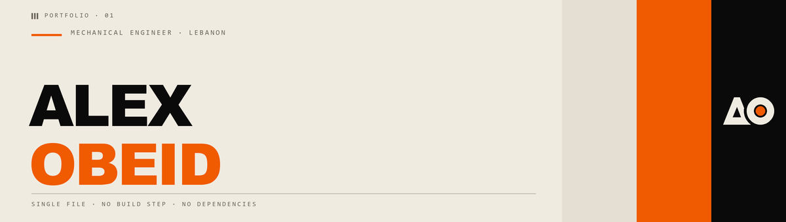
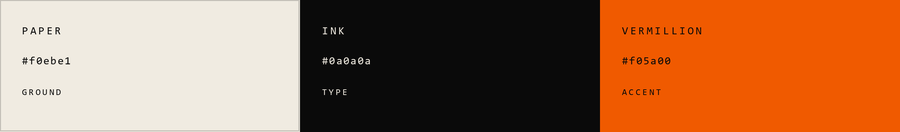

# Alex Obeid — Personal Portfolio

**A single-file, dependency-free portfolio for a mechanical engineering student.**
No build step, no framework, no package manager. Open `index.html` and it runs.

The design language is Swiss / International Typographic Style: heavy neo-grotesque type
at poster scale, flat colour blocking, hairline rules, and no depth effects anywhere.

<table>
<tr>
<td><b>Stack</b></td><td>One HTML file — markup, CSS and JS</td>
<td><b>Dependencies</b></td><td>Google Fonts. That is the entire list.</td>
</tr>
<tr>
<td><b>Pages</b></td><td>6 sections, hash-routed, no router library</td>
<td><b>Build</b></td><td>None. Four optional Python asset scripts.</td>
</tr>
</table>

### Contents

[Running it](#running-it-locally) ·
[Deploying](#deploying) ·
[Design system](#design-system) ·
[How the site works](#how-the-site-works) ·
[Adding a project](#adding-a-project) ·
[Gotchas](#gotchas)

---

## The palette

Three colours. No blue, no green, no second accent, no success/warning set.



| Token | Hex | Role |
| --- | --- | --- |
| `--paper` | `#f0ebe1` | Warm cream. The default ground — never pure white. |
| `--ink` | `#0a0a0a` | Near-black — never pure `#000`. |
| `--orange` | `#f05a00` | Vermillion. The only chromatic colour. |

Applied as **territories** — full-bleed panels that redefine a set of semantic custom
properties, so a component adapts wherever it sits:

| Territory | Ground | Type | Accent |
| --- | --- | --- | --- |
| **Paper** (`:root` default) | cream | ink | vermillion |
| **Vermillion** | vermillion | ink | **ink** |
| **Ink** | ink | cream | vermillion |

> On the orange ground the accent is **ink, not orange**. Orange-on-orange does not exist.
> The accent is always whatever contrasts hardest with the ground.

Apply with `data-territory="vermillion"` or `="ink"` on any element.

**Build against the semantic tokens, never the raw brand colours.** A component using
`var(--fg)` works on all three grounds; one using `var(--ink)` disappears on the Ink panel.

> [!TIP]
> The full design language — tokens, type scale, graphics rules, measured contrast — lives
> in **[DESIGN-SYSTEM.md](DESIGN-SYSTEM.md)**, written so it can be handed to a designer or
> pasted into Claude as standalone context.

---

## Repository

| Path | What it is |
| --- | --- |
| **`index.html`** | The entire site: markup, CSS and JS in one file |
| **`DESIGN-SYSTEM.md`** | The design language as a portable spec |
| `design-system/` | Generated Claude Design bundle — 23 preview cards, `tokens.css`, `system.css` |
| `Design system components/` | Delivered component library — 17 graphics + `GRAPHICS-SPEC.md` |
| `favicon.svg` | AO monogram — A over O, vermillion dot in the counter |
| `favicon.ico` · `apple-touch-icon.png` · `icon-512.png` · `favicon-{16,32,48}.png` | Raster icons, generated from the mark |
| `Images/` | Headshot, Planetary Gearbox photography, and the company logos + generated `masks/` |
| `docs/` | This README's banner and palette strip |
| `tools/` | Four generators — see below |
| `.claude/launch.json` | Local dev-server config (git-ignored) |

Everything except the fonts — icons, paper grain, loading animation, all artwork, the
Snake game — is inline SVG, CSS or vanilla JS.

### Generators

**Edit the generator, never its output.** The next build silently discards hand edits.

```bash
python tools/build-design-system.py   # → design-system/   (23 cards + stylesheets)
python tools/build-icons.py           # → favicon PNGs, from the mark's geometry
python tools/build-banner.py          # → docs/banner.png + palette.png
python tools/build-logo-masks.py      # → Images/Company Logos/masks/
```

---

## Running it locally

`file://` works for everything; nothing here needs a server. If you prefer one:

```bash
python -m http.server 5500
```

Then open `http://localhost:5500/index.html`.

## Deploying

Served from `main`. Any static host works — GitHub Pages, Netlify, Cloudflare Pages, plain
FTP. Upload `index.html`, the icons and `Images/`, preserving folder structure **and
file-name casing** ([why](#gotchas)).

> [!WARNING]
> **GitHub Pages is not enabled yet.** Repo → Settings → Pages → Source: *Deploy from a
> branch* → `main` / `/ (root)`. The site will then be at
> `https://alex-obeid.github.io/Personal_Portfolio/`.

<details>
<summary><b>Shipping the design system to Claude Design</b></summary>

<br>

`design-system/` is a ready-to-push Claude Design project: 23 self-contained preview
pages, each opening with a `<!-- @dsCard group="…" name="…" subtitle="…" viewport="…" -->`
marker that the app compiles into its card index. Cards are grouped **Foundations ·
Brand · Components · Patterns · Graphics**.

Tokens are inlined into every preview rather than linked, so a card renders correctly
regardless of how the host resolves relative paths. `tokens.css` and `system.css` ship
alongside as the canonical copies, and the bundle's `README.md` is a copy of
[DESIGN-SYSTEM.md](DESIGN-SYSTEM.md).

Pushing needs design-system authorization, which only an **interactive** Claude Code
session can grant. Once, on this machine:

```
/design-login
```

Then, from an interactive session in this directory:

```
/design-sync
```

That skill lists your writable projects (or creates one), diffs `design-system/` against
the remote, shows the exact write/delete plan for approval, and uploads. Headless and SDK
runs reuse the authorization afterwards.

**This project is synced as a manual CSS-only bundle** — no `_ds_bundle.js`, no props.
`/design-sync` will resist the repo because it looks for a compiled JS component library
and this site is deliberately one static file; its *Manual CSS-only bundle* option is the
right answer. The pin and a note live in `.design-sync/config.json`.

</details>

---

## Design system

> This section is how the system is *implemented here*. For the language itself, see
> [DESIGN-SYSTEM.md](DESIGN-SYSTEM.md).

### Type

| Face | Use | Setting |
| --- | --- | --- |
| **Archivo Black** | Display, titles, numerals | Uppercase, tight (`-0.03em`) |
| **Archivo** | Body and UI | Normal tracking |
| **DM Mono** | Labels, spec tags, index numbers | Uppercase, `0.2em` tracking |

Helper classes `.t-display` · `.t-title` · `.t-numeral` · `.t-label`. The scale is
deliberately polarised — huge or tiny, nothing in between.

### Interaction: colour inversion

There are **no shadows anywhere**. Hover and press invert colour instead:

```css
.thing        { border:1px solid var(--rule-strong); background:transparent; color:var(--fg); }
.thing:hover  { background:var(--accent); color:var(--on-accent); border-color:var(--accent); }
.thing:active { background:var(--fg);     color:var(--bg);        border-color:var(--fg); }
```

`--snap` (`.16s cubic-bezier(.4,0,.2,1)`) is the standard transition.

### Adding artwork

`.gfx` is a positioning hook for hand-authored SVG. Drop it inside any `.terr` and place
it with inline offsets:

```html
<svg class="gfx" style="left:-80px; bottom:-60px; width:clamp(160px,20vw,320px);">…</svg>
```

It sits behind content and is cropped by the panel edge (`.terr` uses `overflow:clip`).
Use `fill="currentColor"` and the artwork picks up each territory's foreground, so one
file works on all three grounds.

---

## How the site works

The home page is **five stacked territories**, in this order:

| # | Sliver | Territory | What it is |
| :-: | --- | --- | --- |
| 01 | Portfolio | Paper | Hero — name, bio, portrait |
| 02 | Project Gallery | Ink | Horizontal parallax showcase |
| 03 | Skills | Vermillion | Scroll-pinned 3D carousel |
| 04 | Softwares / Programs | Paper | Sticky scroll-highlight reel |
| 05 | Data | Ink | Count-up stat figures |

The fixed nav reads whichever territory is beneath it and adopts its palette.

### Routing

A single-page app with no router library. Every `<section>` is a page; exactly one carries
`.active`, the rest are `display:none`. Sections: `home`, `projects`, `project-detail`,
`contact`, `cv`, `easter`.

| Function | Does |
| --- | --- |
| `navigate(target)` | Plays the three-bar sweep, calls `applySection()` at **730 ms** — when the last layer fully covers the viewport. Sweep is `900 ms` linear per layer, staggered `140 ms`; lock releases at `1180 ms`. |
| `applySection(target)` | Swaps `.active`, restarts `.fade-in`, updates the hash, closes the mobile menu, resets scroll and the momentum scroller. |
| `routeFromHash()` | Runs on load and `hashchange`; unknown hashes fall back to `home`. |

### Momentum scrolling

Desktop scrolling is eased in JS: `ssTarget` accumulates wheel delta and a rAF loop lerps
`ssCurrent` toward it at `SS_EASE` (`0.082`) — lower is a longer glide.

It eases the **real document scroll position** rather than transforming a wrapper. That
matters: the wrapper-transform approach most smooth-scroll libraries use would break
`position:sticky`, which three sections depend on.

> [!IMPORTANT]
> **Scroll-linked animation is driven from `ssApply()`, not the `scroll` event.**
> Programmatic scrolls fire `scroll` unreliably, which left the carousel a frame or more
> behind. Anything tracking scroll position belongs there — the carousel, the parallax
> gallery, the canvas colour and the `--sp` graphics driver all are.

`html { scroll-behavior: auto }` is deliberate; native smooth scrolling fights the loop.
Touch is excluded (`pointer:fine`) — phones already have native momentum — and the whole
thing is off under `prefers-reduced-motion`.

### Section slivers

Each panel carries a mono sliver in its top corner. **The numbers are not in the markup.**
Each mark is an empty `<span class="spec-mark" data-section="Name">`, and
`numberSections()` walks `#home [data-section]` in DOM order filling in `Name · NN`.
Insert, remove or reorder a panel and the rest renumber themselves.

- `data-bars="after"` puts the three-bar cluster on the right, for right-aligned marks.
- A panel can echo its own number inside itself with `[data-section-num]` — the Data panel
  uses this for its `NN — Index` line.

<details>
<summary><b>02 · Project gallery — horizontal parallax</b></summary>

<br>

Scroll-pinned, adapted from [Codrops' horizontal parallax
gallery](https://tympanus.net/codrops/2026/02/19/creating-a-smooth-horizontal-parallax-gallery-from-dom-to-webgl/)
and rebuilt with no dependencies (the original is Vite + TypeScript with a Three.js path).

**Two rows of two, travelling against each other.** Both rows are the same thing — a
project title over its own plates — rendered by the same `pxGroup()`. They differ only in
direction: row A translates `-p × travelA`, row B `-(1-p) × travelB`, so B starts fully
left and unwinds to zero as A unwinds left. Each covers its own full distance over the
same progress; the pin lasts as long as the longer one needs.

| Row | Projects |
| --- | --- |
| A — travels left | Wheel Hub CNC Machining, Generic SUV CFD |
| B — travels right | Formula Student, Custom CNC Machine Design |

Membership lives in `SHOWCASE_ROWS`, **not** `PROJECTS` — the gallery is a curated subset
and Planetary Gearbox is deliberately excluded. Galleries for projects that *do* exist in
`PROJECTS` are referenced rather than copied, so image lists stay single-sourced.

**Parallax** is ported from the demo's three tunables, pushed well past its defaults
because here the whole row is sliding too, which the demo never has to fight:

| Constant | Here | Demo |
| --- | :-: | :-: |
| `PX_INTENSITY` | `1.15` | `0.4` |
| `PX_SHADER_MULT` | `1.75` | `1.0` |
| `PX_UV_SCALE` | `0.64` | `0.85` |

Per plate: `n = (plateCentre − vw/2) / vw`, so **n spans about ±0.5 — the full viewport,
not half**. Drift is `n × intensity × multiplier` as a **fraction of plate width**, so wide
plates travel further. The image is scaled `1/PX_UV_SCALE` (1.563×) — the DOM equivalent
of the shader's `uv -= .5; uv *= uUvScale; uv += .5`, and that zoom is the buffer the
drift moves through. Max drift is **28% of plate width**. Raising intensity means lowering
`PX_UV_SCALE` to match, at the cost of a tighter crop.

Drift is eased into the buffer with `tanh` rather than clipping at it, bounded at
`(1 − uvScale) / (2 × uvScale)` — exactly the headroom the zoom provides — so an image
edge can never appear.

**If it scrolls by hand instead of pinning**, the `.is-strip` fallback is active. Call
`pxWhy()` in the console; it prints which trigger fired. There is **no width gate** — a
narrow desktop window still pins. Only `hover:none` (touch) and `prefers-reduced-motion`
fall back, touch on purpose: the track is several screens wide, so pinning would capture
vertical swipes for a long stretch. Note devtools device emulation also sets `hover:none`
below 768px, so a narrow *emulated* window falls back where a real one would not.

`.px-sticky` carries padding reserving the absolute head and progress bands, so flex
centring cannot push the rows under them; a `max-height:680px` query tightens both.

> Gallery entries ending in an image extension render as photos, anything else as a
> labelled drawing-sheet tile. **Right now every entry is a tile** — the only photographed
> project was the one removed. Drop files into `Images/<Project>/` and swap the strings.

</details>

<details>
<summary><b>03 · Skills carousel — scroll-pinned 3D cylinder</b></summary>

<br>

CSS transforms and `position:sticky`, no library. Skills live in `SKILL_REEL`.

Each is a layer at `rotateX(-i × CYL_ANGLE) translateZ(radius)` inside a `preserve-3d`
container under `perspective`; scroll progress drives the container's `rotateX`. The
negative sign on the item and the positive one on the cage are what set the direction of
travel — flip both to reverse it.

- `CYL_ANGLE` is **32°**, not `360/n`. It is an arc, not a closed circle: tighter spacing
  keeps ~5 copies inside the visible ±90°, which is what creates the stacked cascade.
- Opacity falls off as `cos³·⁴` of the angle from front, so the lead copy reads solid and
  the rest recede. `cos` is even, so reversing direction leaves the falloff untouched.
- `layoutCylinder()` sets **one uniform size for every skill**, scaled up until the longest
  line fills 92% of the stage. The longest string therefore caps the size for all of them.
- `CYL_TIGHTNESS` (`2.15`) multiplies that size to get the radius — it controls overlap.

> [!NOTE]
> **Radius is not independent of type size**, and the two pull against each other. A bigger
> radius brings the front copy closer to the camera, so the fitting pass shrinks the type
> to keep it inside the stage. At 1280px, raising it from 1.45 opened the copies from 67px
> to 99px apart while costing 1px of type. Push much further and the outer copies reach
> past the stage — `.cyl-viewport` has no `overflow`, so they spill over the label and dots.

The wrapper's height (`100vh + 6 × --cyl-step`) is the scroll distance the pinned stage
consumes. Add or remove skills and that `6` must change to match `n − 1`.

</details>

<details>
<summary><b>04 · Software reel — sticky scroll highlight</b></summary>

<br>

Adapted from jh3y's sticky scroll-highlight list: the lead phrase pins at a focal line
while the list scrolls past it, and a **viewport-fixed gradient** is painted through each
item, so whichever one crosses the band lights up. No JS, and it stays in step with the
momentum scroller for free — the band is fixed to the viewport rather than driven by a
scroll handler.

The items are **company logos, painted as alpha masks**. `mask-image` is to an arbitrary
shape what `background-clip:text` was to the glyphs, so the mechanic is identical — only
the stencil changed. Each `<li>` is sized `height:1.55em` (one line, so the scroll timing
is untouched) by `calc(var(--ar) * var(--logo-h))`, with the aspect ratio baked per logo.

`tools/build-logo-masks.py` trims each supplied logo to its ink, scales it to a common
180px height and discards everything but the alpha channel. Two details worth knowing:

- **Only the alpha is kept**, so the logos pick up the panel's own dim → accent ramp
  instead of introducing six brand colours into a three-colour system.
- **Fusion's and AutoCAD's icons are ~97% opaque tiles** with a white glyph sitting on
  top, so their alpha alone silhouettes to a featureless slab. `knockout_light` removes
  the near-white pixels and recovers the letterform. It is deliberately *not* set for
  Python, where 41% of opaque pixels read as light — that is the yellow snake, and
  knocking it out would delete half the mark.

The band's ramp is soft (`±1.05lh` out to dim, `±0.28lh` of solid accent) rather than the
hard edge the text version used. Across thin glyphs a hard edge read as a clean sweep;
across a solid logo tile it split the shape into two flat tones.

Four things that will break it if you edit them:

- **The trailing space must be a sibling** (`.sw-runout`), not margin or padding. A margin
  on the sticky collapses through — `overflow:clip` opens no block formatting context —
  and padding on the panel sits outside the content box the sticky is constrained to.
  Either way the sticky ends up exactly as tall as its container and never pins.
- **Line height is also the scroll distance per item.** The list travels past the band 1:1
  with scroll, so a tight stack reads fast. `1.55` gives ~115px per item.
- `--sw-count` on the panel must match the number of items; the sticky's
  `top: calc((count - 1) * -1lh)` depends on it.
- The sliver is `position:sticky`, not the usual `absolute` — this panel is far taller than
  a viewport and the mark would otherwise scroll up under the fixed nav mid-reel. It is
  `display:flex; height:0`, because the base `.spec-mark` is `inline-flex` and an inline
  child generates a line box, which added a whole 109px line to the panel. The rule is
  scoped `.sw-sect .sw-mark` to beat `.spec-mark`, which appears later in the sheet.

The highlight uses full-strength `--accent`. On cream that is **2.87:1**, just under the
3:1 large-text floor — a deliberate choice to keep the palette to its three colours.

iOS Safari ignores `background-attachment:fixed`, so touch and `prefers-reduced-motion`
both get a solid static list instead.

</details>

<details>
<summary><b>05 · Data panel — count-up stat</b></summary>

<br>

The three figures use **`gfx-count` (16 · Count-up stat)** from
`Design system components/handoff/`. Each numeral counts to its target the first time it
enters the viewport and the accent rule draws out beneath it. As the component's manifest
intends, it feeds the existing `.stat-row` pattern rather than replacing it — the grid and
`.stat-meta` column are untouched.

- The shipped file animates on **CSS only**, because the component catalogue previews it
  inside an iframe whose document is `visibilityState:"hidden"`, where rAF and timers are
  throttled dead. That demo block is deliberately **not** copied here; the driver from
  `GRAPHICS-SPEC.md` runs it instead.
- One addition to that driver: the value is padded back to the width it was authored at,
  so `data-gfx-count-to="03"` renders `03` rather than `3`.
- The counting target is an inner `<span data-gfx-count-to>` so the year's `'` unit is a
  sibling and survives the `textContent` writes.
- Resting values are in the markup, so figures are correct with JS off, and the observer
  unobserves on first hit — it never replays on scroll back.

</details>

<details>
<summary><b>Placed graphics — split disc & stripe fan</b></summary>

<br>

| Component | Where | Notes |
| --- | --- | --- |
| **05 · Plate — split disc** | Softwares | Turned portrait and inverted: cream ground, orange discs, the lens intersection and the slash knocked out in the ground. Centres transposed from `(112,100)/(208,100)` on the 320×200 board to `(100,112)/(100,208)` on a 200×320 one, so the arcs stay axis-aligned. No keyline — the ground is the panel's own, so it reads as artwork rather than a plate laid over it. **Hidden below 768px**: the lead and list already use 349px of a 375px viewport. |
| **02 · Stripe fan** | Skills | Its `color:var(--accent)` resolves to ink on the vermillion ground, so it is **already black there** with no override. Shears with scroll via `--sp`. |

`--sp` comes from one shared driver for all `[data-gfx-scroll]` elements, called from
`ssApply()` as well as the `scroll` event. Reduced motion pins it to `1`, which is each
component's *finished* state, not its starting one.

</details>

<details>
<summary><b>Loading animation, contact form, easter egg</b></summary>

<br>

**Loading animation.** Ink panel. A rule draws, the **AO mark** rises from behind it as a
mask reveal, then a mono spec line fades in. On close the mark drops back below the rule
and the panel slides up to wipe the hero into view.

The stack is a fixed measure with the mark centred over it — rule 10 permits centring a
single mark. The rise is `translateY(130%)`, a percentage of the mark's own height, so it
tracks the `clamp()` size. Mark colours are local custom properties on `.startup-intro`
rather than `data-territory="ink"`: the intro is `position:fixed` over the whole viewport,
and the canvas prober would otherwise read it as the territory on screen.

Timings live in JS — `closing` `1620 ms`, `done` `2080 ms`, `hidden` `2780 ms`. Skipped
under `prefers-reduced-motion`.

**Contact form.** `handleForm()` validates and shows a "Message Sent ✓" confirmation.
**It does not send anything** — no backend, no form service. See [Gotchas](#gotchas).

**Easter egg.** The keylined triangle at the right of the footer opens `#easter`, a Snake
game on a 420×420 board. Fixed 130 ms timestep with interpolated rendering, WebAudio
blips, and `localStorage` for best score (`snakeBest`) and the top five (`snakeScores`).
50 points wins. Keyboard input is only captured while `#easter` is active.

The board is drawn as a drafting sheet: hairline cell dots, a heavier rule every seven
cells (21 divides by 7), and a registration crosshair on the target. The snake is paper,
tapering from a 1 px inset at the head to 4 px at the tail so **direction reads by shape,
not by a fourth colour** — the only vermillion on the board is the food.

- **The canvas is DPR-scaled.** `sizeCanvas()` sets the backing store to `420 × dpr` and
  transforms the context, so all drawing is still in 420-unit CSS space. Draw in CSS
  units; never assume `canvas.width` is 420.
- **Turns are queued, not overwritten.** `dirQueue` buffers up to two, each validated
  against the previous queued turn rather than the current heading. Overwriting meant two
  presses inside one 130 ms tick collapsed into the last one and silently dropped a dodge.
- **The tail is not a collision.** It vacates on the same tick unless the snake grows, so
  `stepGame()` tests against `snake.slice(0, -1)` when it hasn't eaten.
- **`AudioContext` is lazy.** Constructing it at page load leaves it suspended and logs a
  warning; `audio()` builds it on the first gesture.
- **Touch is swipe-to-steer, tap to start/pause**, which needs `touch-action:none` on the
  canvas. `TOUCH` also swaps the overlay and hint copy from "Press Space" to "Tap".

</details>

---

## Projects

Content lives in the `PROJECTS` array. Cards in `#projects` are hand-written HTML; clicking
one calls `openProject(idx)`, which fills `#project-detail`.

> [!CAUTION]
> **`idx` is a raw array index and does not match the number on the card.** The card
> labelled `03` (Planetary Gearbox) calls `openProject(0)`; `01` calls `openProject(1)`;
> `02` calls `openProject(2)`. Check the array, not the badge.

### Adding a project

**1.** Add an entry to `PROJECTS`:

```js
{
  num: '04',
  badge: 'Category · Discipline',            // shown top-left of the detail hero
  heroImage: 'Images/My Project/hero.png',   // optional; omit for a plain panel
  title: 'My Project',
  tags: ['SolidWorks', 'FEA'],
  meta: [{ k: 'Year', v: '2026' }, { k: 'Role', v: 'Design' }],
  body: `<p>Paragraphs of HTML.</p>`,
  gallery: [
    'Images/My Project/photo-1.jpg',   // image paths render as photos
    'Caption Only Tile',               // any other string renders as a labelled tile
  ],
}
```

`gallery` entries ending `.png/.jpg/.jpeg/.gif/.webp/.svg` render as ``; anything else
becomes a labelled placeholder tile. Same convention for `heroImage` — omit it and the hero
shows the panel ground with the `num` watermark.

**2.** Copy an existing `.proj-brick` inside the right `.projects-group` and point its
`onclick` at the new index.

**3.** Pick a size class — `tall` (3:4), `wide` (16:9), `sq` (1:1), `short` (4:3), `mini`
(3:2) — and a colour class `ca`–`ch`. These are **flat panels, not gradients**: `cb/ce/ch`
are ink, `cc/cf` are orange, the rest paper-shade. Each sets `--v-bg` and `--v-fg`, so the
badge and corner marks adapt automatically.

Masonry is CSS `columns: 3`, dropping to 2 at 1000px and 1 at 580px.

To add a project to the **home gallery** instead, add it to `SHOWCASE_ROWS` — that list is
separate on purpose.

---

## Gotchas

> [!CAUTION]
> **Image paths are case-sensitive on the deploy target.** Windows and macOS don't care if
> `Images/Main-Render.png` is referenced as `images/main-render.png`; GitHub Pages
> (Linux-backed) does, and a mismatch 404s in production with no error locally. All current
> references match on-disk casing exactly — keep it that way.

| | |
| --- | --- |
| **Text fitting must wait for fonts** | `layoutCylinder()` measures rendered text width. Against fallback metrics it oversizes every line by ~13%, so it re-runs on `document.fonts.ready`. Any new measure-then-size code needs the same treatment. |
| **`overflow:hidden` breaks pinning** | It creates a scroll container and kills `position:sticky`. `.terr` uses `overflow:clip`, which clips without that side effect — but note `clip` opens no block formatting context, so margins still collapse through it. |
| **Placeholders are not real work** | Every home-gallery entry and several project galleries are labelled tiles awaiting photos and CFD/CAD screenshots. |
| **The contact form is decorative** | Wire it to Formspree / Web3Forms / a `mailto:` fallback, or replace it with the footer email link. |
| **The home bio is `contenteditable`** | Visitors can type over it; edits save nowhere. A leftover from the original template. |
| **Project cards are `<div onclick>`** | Not keyboard-reachable, not announced as interactive. The home gallery's titles were made real `<button>`s for this reason; the project cards still need it. |
| **No print stylesheet** | The CV's "Download / Print CV" calls `window.print()` and prints the screen styles as-is. |
| **Images are unoptimised** | `Main-Render.png` alone is ~595 KB; `Images/` is ~1.1 MB. WebP at sensible dimensions would cut that substantially. |

---

<div align="center">

**[DESIGN-SYSTEM.md](DESIGN-SYSTEM.md)** · Swiss / International Typographic Style · No build step

</div>
